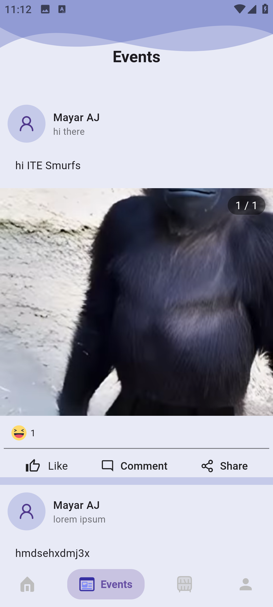
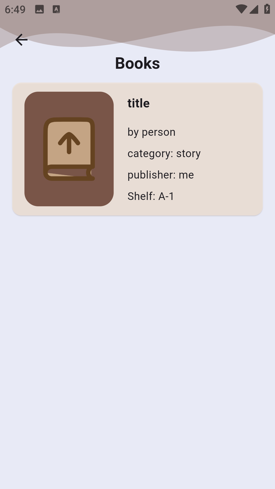
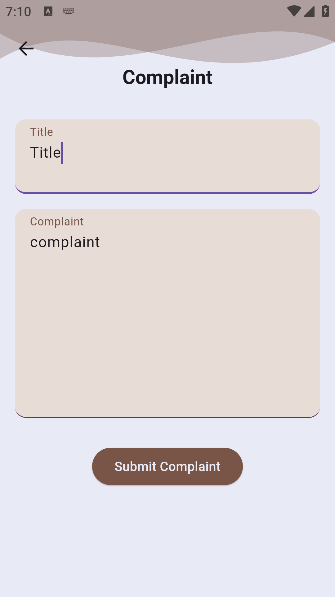

# Menirva School Management System

A comprehensive Flutter-based school management system that provides different interfaces and functionalities for various roles within the educational institution.

## 🚀 Technologies & Architecture

-   **Framework:** Flutter 3.8+
-   **State Management:** Flutter Bloc & GetX
-   **Architecture:** MVC (Model-View-Controller)
-   **Authentication:** Local Auth & PIN-based security
-   **Localization:** Multi-language support (Arabic/English)
-   **Backend Integration:** RESTful API using HTTP package
-   **UI Components:** Material Design & Custom Widgets

## 📦 Main Packages

-   **State Management**

    -   `flutter_bloc`: ^9.1.1 - For robust state management
    -   `get`: ^4.7.2 - For navigation and dependency injection

-   **UI/UX**

    -   `google_fonts`: ^6.2.1 - For custom typography
    -   `flutter_svg`: ^2.1.0 - For SVG asset handling
    -   `carousel_slider`: ^5.1.1 - For image sliders
    -   `salomon_bottom_bar`: ^3.3.2 - For bottom navigation
    -   `smooth_page_indicator`: ^1.2.1 - For page indicators

-   **Authentication & Security**

    -   `local_auth`: ^2.3.0 - For biometric authentication
    -   `pinput`: ^5.0.1 - For PIN input fields

-   **Utilities**
    -   `shared_preferences`: ^2.5.3 - For local storage
    -   `translator`: ^1.0.3+1 - For text translation
    -   `timeago`: ^3.7.1 - For time formatting
    -   `firebase_messaging`: ^16.0.0 - For push notifications

## 🎯 Key Features

-   Multi-role user system (Student, Teacher, Librarian, Nurse)
-   Biometric authentication
-   Multi-language support
-   Event management system
-   Library management system
-   Complaint management system
-   Push notifications
-   File sharing capabilities
-   Profile management

## 📱 Screenshots

### Student Interface

#### Home & Profile

<table>
  <tr>
    <td><strong>English Home</strong></td>
    <td><strong>Arabic Home</strong></td>
    <td><strong>Profile</strong></td>
  </tr>
  <tr>
    <td></td>
    <td></td>
    <td></td>
  </tr>
</table>

#### Academic & Events

<table>
  <tr>
    <td><strong>Weekly Schedule</strong></td>
    <td><strong>Events List</strong></td>
    <td><strong>Event Comments</strong></td>
  </tr>
  <tr>
    <td></td>
    <td></td>
    <td></td>
  </tr>
</table>

#### Library & Complaints

<table>
  <tr>
    <td><strong>Browse Books</strong></td>
    <td><strong>Borrow Book</strong></td>
    <td><strong>New Complaint</strong></td>
    <td><strong>Previous Complaints</strong></td>
  </tr>
  <tr>
    <td></td>
    <td></td>
    <td></td>
    <td></td>
  </tr>
</table>

### Librarian Interface

#### Home & Book Management

<table>
  <tr>
    <td><strong>Dashboard</strong></td>
    <td><strong>Books List</strong></td>
    <td><strong>Book Details</strong></td>
  </tr>
  <tr>
    <td></td>
    <td></td>
    <td></td>
  </tr>
</table>

#### Add New Books

<table>
  <tr>
    <td><strong>Empty Form</strong></td>
    <td><strong>Filled Form</strong></td>
  </tr>
  <tr>
    <td></td>
    <td></td>
  </tr>
</table>

#### Borrow Requests Management

<table>
  <tr>
    <td><strong>Pending Requests</strong></td>
    <td><strong>Accepted Requests</strong></td>
    <td><strong>Rejected Requests</strong></td>
  </tr>
  <tr>
    <td></td>
    <td></td>
    <td></td>
  </tr>
</table>

#### Complaints Management

<table>
  <tr>
    <td><strong>View Complaint</strong></td>
    <td><strong>Edit Complaint</strong></td>
    <td><strong>Save Complaint</strong></td>
  </tr>
  <tr>
    <td></td>
    <td></td>
    <td></td>
  </tr>
</table>

## 🛠 Setup & Installation

1. Clone the repository
2. Ensure Flutter 3.8+ is installed
3. Run `flutter pub get` to install dependencies
4. Configure your environment variables
5. Run the application using `flutter run`

## 🌐 Supported Platforms

-   Android
-   iOS
-   Web
-   Linux
-   Windows
-   macOS

## 📁 Project Structure

```
lib/
├── 🌐 api/              # API service layer
├── 🎮 controller/       # Business logic and state management
│   ├── 🔐 auth_controller/
│   ├── 📚 library_controller/
│   ├── 👩‍⚕️ nurse_controller/
│   └── 👨‍🎓 student_controller/
├── ⚙️ core/            # Core utilities and services
│   ├── 🌍 localization/
│   ├── 🛡️ middleware/
│   ├── 🔧 services/
│   └── 🛠️ utils/
├── 📊 models/          # Data models
│   ├── 🌐 global/
│   ├── 📚 librarian_model/
│   ├── 👨‍🎓 student_model/
│   └── 👨‍🏫 teacher_model/
├── view/            # UI screens
└── widgets/         # Reusable widgets
```

## 🔧 Environment Setup

1. **Flutter SDK Setup**

    ```bash
    flutter channel stable
    flutter upgrade
    flutter doctor
    ```

2. **Environment Variables**
   Create a `.env` file in the root directory:

    ```env
    API_BASE_URL=your_api_url
    FIREBASE_PROJECT_ID=your_project_id
    ```

3. **Firebase Setup**
    - Add `google-services.json` for Android
    - Add `GoogleService-Info.plist` for iOS

## 📝 Changelog

### Version 1.0.0 (Current)

-   Multi-role user system implementation
-   Library management features
-   Event management system
-   Complaint handling system
-   Multilingual support (Arabic/English)

### Planned Features

-   [ ] Push notification system
-   [ ] Advanced reporting system
-   [ ] Parent portal
-   [ ] Online assessment module

## ❓ Troubleshooting

### Common Issues

1. **Build Failures**

    ```bash
    flutter clean
    flutter pub get
    ```

2. **Firebase Integration**

    - Ensure Firebase configuration files are properly placed
    - Check Firebase dependencies in pubspec.yaml

3. **Localization Issues**
    - Verify language files in assets/locales
    - Check locale settings in main.dart

## �📄 License

This project is licensed under the MIT License, which allows you to:

-   ✔️ Use the software for commercial purposes
-   ✔️ Modify the source code
-   ✔️ Distribute the software
-   ✔️ Use and modify the software privately

The only requirement is to include the original copyright notice and license in any copy of the software/source.

See the [LICENSE](LICENSE) file for the full license text.
